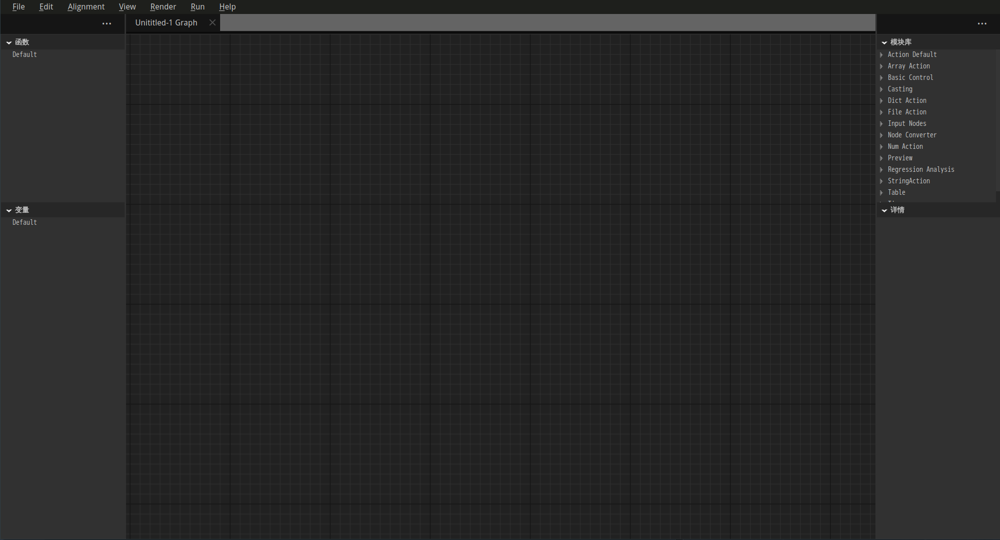
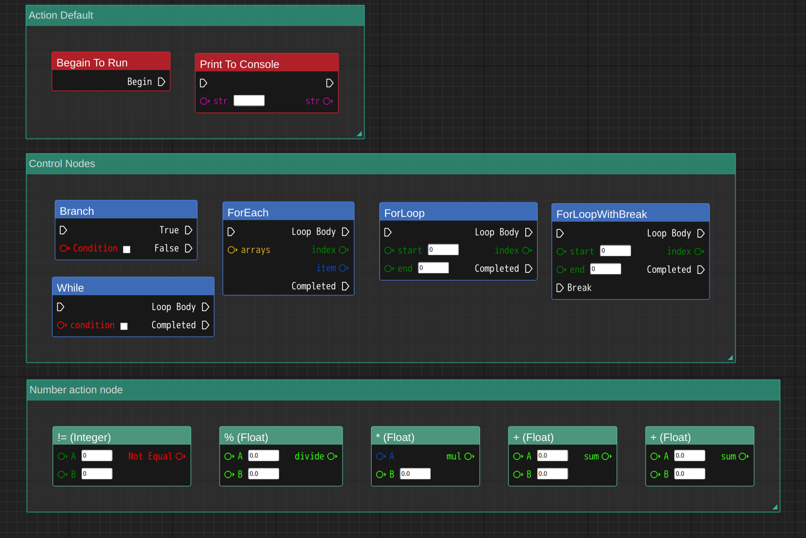
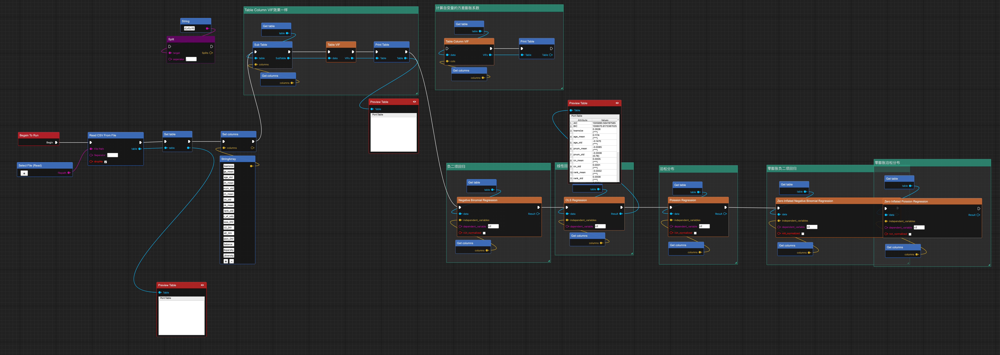

## Visual Graph in python
基于PySide6的python节点编辑器实现，目前只实现了基础功能。

### 1 需要的库
  
    1. PySide6 （注意提前卸载环境中的其他QT环境，例如pyqt5等，否则会造成QT的动态链接库连接错误，尤其是Anaconda环境）

    2. pandas、numpy、scipy、statsmodels (非节点编辑必须，但是目前没有分离出来)

### 2 运行
在根目录执行

    python src/edtior/main.py 

这里执行路径很重要，本项目有所的import都是根据执行文件夹的相对路径，在不同路径内执行可能导致module找不到，或者资源找不到的情况。

### 3 当前成果的部分截图

1. Editor 截图

2. Node列表

3. 其他测试

### 4 未来计划
规划的内容与未来可能要添加的功能在plan文件夹下，会不定时的更新与添加。

### 5 关于
本项目是业余练习项目，不对任何因参考本项目而导致的不良后果负责。

